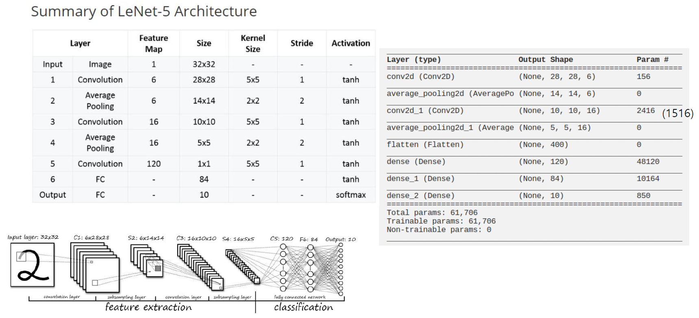

# LeNet-5 
This repo provides the example of LeNet-5 Model implemented by PyTorch.

## Model
LeNet-4 is the one of most popular models for the numerical recognition.
It is consist of the feature extraction(CNN) and the classification(FC).


## Operation
### Prerequisites
1. Python3
2. PyTorch
   - Install in `Conda` environment if necessary

### How to run
1. (option) conda active
2. model train
3. model test
```bash
conda active {my_env}
python LeNet5_train.py
python LeNet5_test.py
```